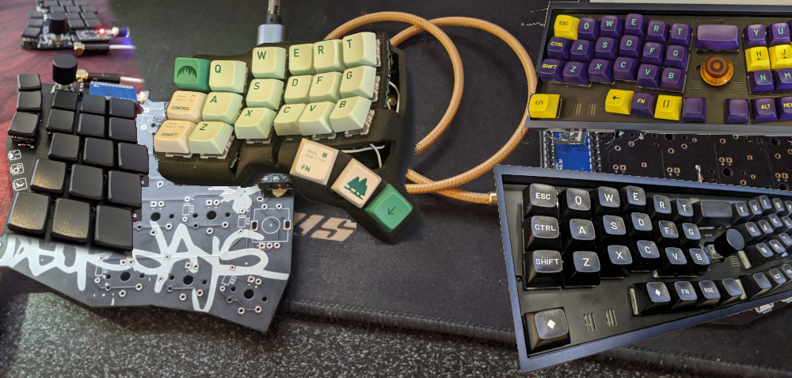

Hey, I'm Nicky, I like to make stuff.

I made some weird keyboards that I now use daily.

I'm a huge Neovim fan, my config is [here on GitHub](https://github.com/NickyTope/nixos-config/tree/master/dotfiles/nvim/)

Have recently moved to NixOS after using Arch Linux for years, the learning curve was tough at the start but the payoff seems worthwhile, I manage my work laptop and home server configuration in the same [GitHub repo](https://github.com/NickyTope/nixos-config)

I write code, lot's of it... mostly Node/React but also python, ansible, Jenkins, Go, a little c and plenty of bash(👊).
