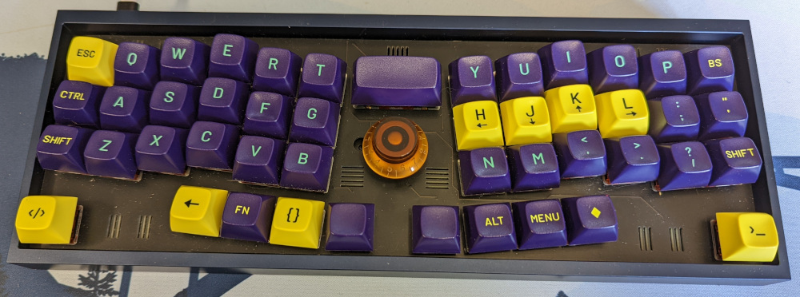

Hey, I'm Nicky, I like to make stuff.

I made some weird keyboards that I now use daily.

I'm a huge Neovim fan, my config is [here on GitHub](https://github.com/NickyTope/dotfiles/tree/master/nvim/.config/nvim)

Lately I've been working on and enjoying kubernetes, I love the automation control it can provide.

I write code, lot's of it... mostly Node/React but also python, ansible, Jenkins, Go, a little c and plenty of bash(👊). Have been learning some Lua (for my nvim config) and it's been a fun learning experience.
